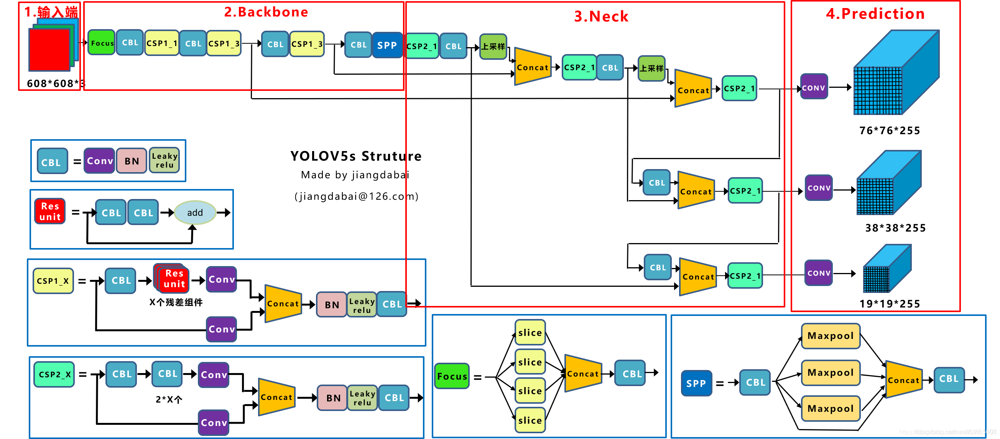
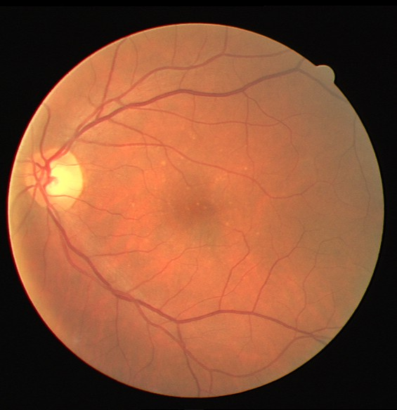
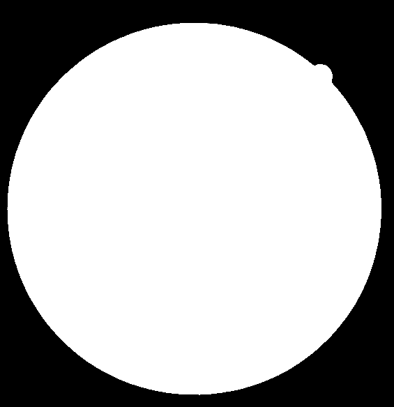

# **智能眼底影像分析**

[原始数据集](https://drive.google.com/drive/folders/1H1xD5riEKEmm_riY_nZoa4Yesi6OS7Rv?usp=sharing)、[模型权重](https://drive.google.com/drive/folders/1cdNCKqMRbC4SzH3-bI2en9IaWtvmGPO2?usp=sharing)

## 任务一：中心凹检测定位

### 模型简述

   在此任务中我们选择了以YOLOv5模型为基础进行眼底图像中心凹的定位检测。YOLO模型发展到最新的第五代已经算是一个非常成熟的体系了，相关的数据预处理、预训练权重、调参流程和结果可视化都做得比较完备，这也是我们选择使用它进行目标检测任务的一个原因。

另外一点原因则是由于项目本身的特性。我们观察原始数据集后不难看出，每幅图像只有一个检测目标，并且标定框的尺寸相对于整幅图片来说也不是很小，因此即使是使用单阶段检测方法也能获得不错的效果，此外我们也考虑过使用基于注意力机制的端到端检测方法，但是由于标定数据集较少我们最终还是决定使用YOLOv5进行训练。



YOLOv5在第三代和第四代的基础上做出了一些调整。在输入端除了保留Mosaic数据增强方法、它还增加了自适应锚框计算、自适应图片缩放等功能。backbone方面，v5在输入端后的降采样方式更新为Focus模块并且调整了CSP的内部结构。在neck层级中保留了v4的融合多尺度特征图的方式。


### 训练流程

#### 数据准备：（[这是处理好的数据集->模型训练](https://drive.google.com/drive/folders/1KVLMk71KkgyeYAE99oK1pT_zcdwYFJjD?usp=sharing)）

我们拿到手的原始数据集内容是八十张眼底图像和对应的边界框标签数据。

```html
中心凹检测
|---train（图片）
|---train_location（标签）
|---fovea_localization_train_GT.csv（框中心坐标）
```

为了将数据转换成YOLO对应的格式，我们参考了YOLOv5项目内提供的方法：在 [Roboflow](https://roboflow.com/?ref=ultralytics) 网站上传图片和相应的标签文件即可生成YOLO可用的数据集，并且还可以选择进行图像预处理和数据增强。除了自定义的数据集，YOLOv5还有五种规模的网络和预训练权重可供选择，我们选用的是YOLOv5m。


#### 模型训练：

首先要把项目克隆到本地，然后配置相应环境。这里我们选择在本地跑通调试好再上传到服务器进行训练，如果设备中已经有部分所需的环境（pytorch，torch vision等）则最好根据需求列表手动安装，否则可能会产生一些版本覆盖情况发生，最终导致相关的库之间版本不匹配。

在服务器端则可以直接运行下述命令行指令：

```python
git clone https://github.com/ultralytics/yolov5  # clone
cd yolov5
pip install -r requirements.txt  # install
```

配置好环境后要进行相关路径设置，为了不改动源项目，我们在这的操作都是先复制副本，再在副本上进行修改。

```
本地项目的文件目录部分内容如下（下载的处理好的数据集要放在此文件夹中）：
yolov5_for_detection
|---models
    |---yolov5m.yaml
|---data
|---datasets_for_yolov5
    |---fovea_data.yaml
|---runs
|---train.py
|---detect.py
|---yolov5m.pt
```

首先复制一份yolov5m.yaml的模型描述文件，重命名为 fovea.yaml 。进入文件后修改分类数即可（想修改anchor尺寸也可以，但是对效果提升没什么帮助）。如果是编译器中运行那么要在train文件修改参数，或者也可以直接命令行运行下面的指令。

模型运行时所保存的数据和权重都在runs文件夹下，也可以通过tensor board实时查看可视化的训练过程。

```python
python train.py --data datasets_for_yolov5/fovea_data.yaml --cfg models/fovea.yaml --weights yolov5m.pt --epochs 100 --batch-size 16
TensorBoard: Start with 'tensorboard --logdir runs\train', view at http://localhost:6006/
```


### 实验和结果分析

#对比一下做和不做数据扩充在收敛速度上的区别

**正常数据集:**

​	正常数据集共有79张图片与对应的标签(检测坐标), 这里我们将训练集与数据集按 8 : 2 划分, 并在yolov5的预训练参数yolov5m.pt的基础上进行训练。


**实验结果:**

训练100轮的结果:


由于是单目标物体检测，我们重点关注的指标是mAP_0.5 和 mAP_0.5 : 0.95

- mAP_0.5:  在Iou阈值为0.5下的均值平均精度值
- 表示在不同IoU阈值（从0.5到0.95，步长0.05）（0.5、0.55、0.6、0.65、0.7、0.75、0.8、0.85、0.9、0.95）上的平均mAP。


同时，我们观察到recall的值在训练过程中波动较大。

可能是因为我们检测的目标较小，下面我们通过数据增强的方式加强模型对小物体的检测能力。


**数据增强:**

- Flip: Horizontal   （水平翻转）


- Brightness: Between -20% and +20%   (亮度调整)


- Mosaic: Applied


- Grayscale: Apply to 45% of images


- Hue: Between -30° and +30°   (颜色变换)


- Exposure: Between -15% and +15%  (曝光)

数据增强后， 训练集大小为原来的六倍。


**数据增强效果:**

原图像:


数据增强:

|  |  |  |
| :----------------------------------------------------------: | :----------------------------------------------------------: | :----------------------------------------------------------: |
|  |  |  |


**训练50轮过程对比**

|           |                           normal                            |                       enhance                        |
| --------- | :---------------------------------------------------------: | :--------------------------------------------------: |
| map_0.5   |      |      |
| 0.5:0.95  |  |  |
| precision |    |    |
| recall    |       |       |


**数据增强 训练50轮的结果:**


可以看到训练50轮后效果已经非常好, mAP_0.5 : 0.95 达到了0.9及以上。


------

## 任务二：血管分割

### 模型简述

这是一个二值的语义分割任务，数据集只有二十份眼底照片和对应的血管分割标签。鉴于这样的项目特性，我们在这一任务中选择了U-net网络。

U-Net诞生的一个主要前提是，很多时候深度学习的结构需要大量的sample和计算资源，但是U-Net基于FCN（全卷积神经网络）进行改进，并且利用数据增强（data augmentation）可以对一些比较少样本的数据进行训练，特别是医学方面相关的数据（医学数据比一般我们所看到的图片及其他文本数据的获取成本更大，不论是时间还是资源的消耗），所以U-Net的出现对于深度学习用于较少样本的医学影像是很有帮助的。


整个神经网络主要有两部分组成：收缩路径（contracting path）和扩展路径（expanding path）

收缩路径是一个常规的卷积网络，它包含重复的2个3x3卷积，紧接着是一个RELU，一个max pooling（步长为2），用来降采样，每次降采样我们都将feature channel扩大一倍。两个3x3的卷积核之后跟一个2x2的最大化池化层，缩小图片的分辨率。扩展路径包含一个上采样（2x2上卷积），将图像大小扩大一倍，然后再使用普通的3x3卷积核，再将通道数feature channel缩小一倍。在扩展过程中将相应的下采样feature maps裁剪并且跨层连接。

原论文在收缩和扩张时的特征图尺寸是不一样的，这个在实现时会比较麻烦，因此我们的代码中在最底层卷积时加入了padding操作，保证两端的尺寸一致方便拼接，此外我们也用双线性插值代替了原来的升采样所使用的转置卷积，在横向3x3卷积时让通道数减半。


### 训练流程

#### 数据准备：（[这是处理好的数据集->模型训练](https://drive.google.com/drive/folders/16Usia2gUBUzLglrNI2edM5iJaclvrZrj?usp=sharing)）

在此任务中，我们的原始数据集是二十份眼底图像和对应的血管分割二值化图像。

```html
血管分割
|---images（tif格式的眼底图片）
|---1st_manual（gif格式的二值化血管分割图）
```

|  |  |  |
| :-------------------------------------------------: | :------------------------------------------------: | :-------------------------------------------------: |

这里为了排除眼底图像中黑色边框的干扰，要先生成一个mask，这里将项目和数据文件按照如下路径设置并运行`create_mask.py`即可。

```
本地项目的文件目录部分内容如下（下载的处理好的数据集要放在此文件夹中）：
U-net_for_segmentation
|---src
|---train_utils
|---save_weights
|---datasets_for_U-net
    |---training
        |---1st_manual
        |---images
        |---mask
|---train.py
|---predict.py
|---create_mask.py
```


#### 模型训练：

由于这个模型比较小且任务范围有限，因此没有设置载入与训练权重的方法。只需根据上面的文件目录设置好文件位置并在`train.py`的参数列表修改对应路径，或者是在命令行直接输入下面的命令即可进行训练。

```python
python train.py --data-path datasets_for_U-net --epochs 30 --batch-size 4
```

模型的权重保存在`save_weights`文件夹中，若要用训练好的模型进行预测，需要在`predict.py`中修改相应的路径即可进行分割。

在训练时，模型会对输入图像进行一些翻转和随机裁剪的处理来防止过拟合。


### 实验和结果分析

#这个没啥说的 就结合结果的dice分析一下吧

**把结果贴上来，不知道分析什么。。。**

------


## 任务三：糖尿病视网膜病变分级

### 模型简述

这一任务在许多深度学习的比赛中都曾出现，我们在查阅资料时发现，大多数效果较好的模型都是采用了Efficient Net，也有一部分是结合了Res-Net、Inception、Mobile Net做集成学习，但是后者的训练代价是很大的，而且效果也没有特别明显的突破。所以我们最终还是决定选用efficient net v2来做这个分类任务。

Efficient Net的作者通过调整网络的宽度、深度以及输入网络的分辨率来提升网络的性能，最终得到了一系列适用于不同分表率的模型。但是第一代Efficient Net在训练时却很耗费显存并且收敛速度也没有达到理想值，因此作者对第一代的网络做了一些改动，使用Fused-MBConv替换掉了浅层的MBConv，并且设计了渐进式的学习策略来减少训练时间。


### 训练流程

#### 数据准备：（[这是处理好的数据集->模型训练](https://drive.google.com/drive/folders/1T54Cn1Y98KO_SauicJ22tQQ20ZGFlTK3?usp=sharing)）

我们拿到手的原始数据集内容是一千张眼底图像和对应的边界框标签数据。

```html
眼底分级
|---train（图片）
|---Mess1_annotation_train.csv（标注数据）
```

|      |         image          | quality | type | Retinopathy_grade | Risk_of_macular_edema |
| :--: | :--------------------: | :-----: | :--: | :---------------: | :-------------------: |
|  0   | 20051019_38557_0100_PP |    0    | _000 |         3         |           1           |
|  1   | 20051020_43808_0100_PP |    1    | _101 |         0         |           0           |
|  2   | 20051020_43832_0100_PP |    2    | _111 |         1         |           0           |
|  3   | 20051020_43882_0100_PP |    2    | _111 |         2         |           0           |
| ...  |          ...           |   ...   | ...  |        ...        |          ...          |

原始数据集中各等级的图片是混在一起的，我们要根据表格的`retinopathy_grade`列将它们分别存到四个文件夹中。

将项目和数据文件按照如下路径设置并运行`preparing_data.py`即可。

```
本地项目的文件目录部分内容如下（下载的处理好的数据集要放在此文件夹中）：
efficientnetV2_for_classification
|---weights
|---runs
|---save_weights
|---estimate_info
|---datasets_for_efficientnetV2
    |---0
    |---1
    |---2
    |---3
|---train.py
|---predict.py
|---preparing_data.py
|---pre_efficientnetv2-s.pth
```

这里我们最先做的是四分类任务，如果要改成二分类，手动将文件夹0、1和文件夹2、3分别合并即可。


#### 模型训练：

按照文件目录设置好以后，在`train.py`的参数列表中修改相应路径，或直接在命令行中输入下面的命令即可进行训练。

```python
python train.py --data-path datasets_for_efficientnetV2 --epochs 30 --batch-size 8 --weights pre_efficientnetv2-s.pth --freeze-layers False
```

模型的权重会保存在`weights`文件夹中，并且会将训练过程中错分类的情况保存在`estimate_info`中

```python
estimate_info的部分内容
[epoch(train): 0 ]
precision: 0.878788, 0.721649, 0.781250, 0.912162
recall: 0.943089, 0.642202, 0.753012, 0.859873
err_name_list [图片名, 原始标签, 错判标签]:
path: 1/20051202_38513_0400_PP.png    1    3
path: 2/20051202_55484_0400_PP.png    2    3
path: 3/20051020_44598_0100_PP.png    3    2
...
```


### 实验和结果分析

第一类数据的数量为597个, 第二类数据的数量为403个，样本相对较为平衡。


采用原数据与预训练参数"pre-efficientnetv2-s.pth"进行训练100轮的结果如下:

|                          train_acc                           |                          normal_acc                          |
| :----------------------------------------------------------: | :----------------------------------------------------------: |
|  |  |

可以观察到，随着训练轮数的增加, train_acc一直在增强, normal_acc波动较大，出现了一定的过拟合。

训练一百轮后的准确率大约为87%。


**数据预处理**

- 基于眼球的resize： scaleRadius()

因为不同图片长宽比不同，且眼球外围黑边宽度各不相同，所以resize不能以整个图像的尺寸为准。因此，以眼球半径为基准，resize图片。

- 特征增强

第二步是关键的一步，使得不同图像显示效果更加一致，同时凸显特征。

- 去除眼球周围部分

|  |  |
| :----------------------------------------------------------: | :----------------------------------------------------------: |
|  |  |


利用预处理后的数据进行处理, 同样的预训练参数训练一百轮。

**训练结果:**

| tran_acc                                                     | val_acc                                                      |
| ------------------------------------------------------------ | ------------------------------------------------------------ |
|  |  |

训练100轮后在测试集上的分类准确率约为91%, 相比于未进行数据预处理提高了4%，可能是因为数据预处理让图像的特征更明显，更容易被学习提取特征， 网络在数据预处理后有了更好的表现。


------

### 参考项目：

- https://github.com/ultralytics/yolov5.git
- https://github.com/milesial/Pytorch-UNet.git
- https://github.com/WZMIAOMIAO/deep-learning-for-image-processing.git
